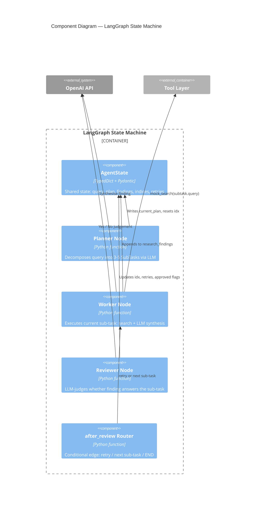
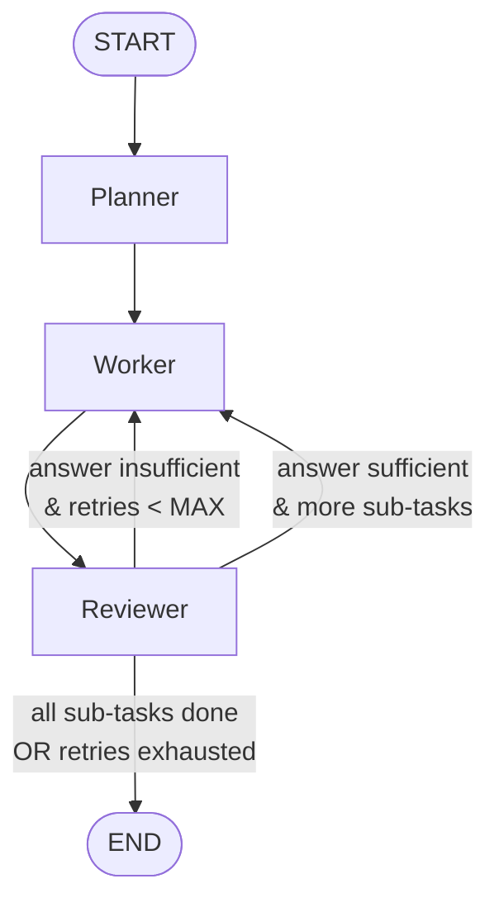

# C4 — Level 3: Component

Zooms into the LangGraph State Machine container showing individual nodes and edges.

```mermaid
C4Component
    title Component Diagram — LangGraph State Machine

    Container_Boundary(graph, "LangGraph State Machine") {
        Component(state, "AgentState", "TypedDict + Pydantic", "Shared state: query, plan, findings, indices, retries")
        Component(planner, "Planner Node", "Python function", "Decomposes query into 3-5 SubTasks via LLM")
        Component(worker, "Worker Node", "Python function", "Executes current sub-task: search + LLM synthesis")
        Component(reviewer, "Reviewer Node", "Python function", "LLM-judges whether finding answers the sub-task")
        Component(router, "after_review Router", "Python function", "Conditional edge: retry / next sub-task / END")
    }

    System_Ext(openai, "OpenAI API")
    Container_Ext(tools, "Tool Layer")

    Rel(planner, state, "Writes current_plan, resets idx")
    Rel(worker, tools, "mock_search(subtask.query)")
    Rel(worker, openai, "Synthesise finding")
    Rel(worker, state, "Appends to research_findings")
    Rel(reviewer, openai, "Yes / No judgement")
    Rel(reviewer, state, "Updates idx, retries, approved flags")
    Rel(router, worker, "retry or next sub-task")
```

## Graph Topology (flowchart)

```mermaid
flowchart TD
    START([START]) --> Planner
    Planner --> Worker
    Worker --> Reviewer
    Reviewer -->|"answer insufficient\n& retries < MAX"| Worker
    Reviewer -->|"answer sufficient\n& more sub-tasks"| Worker
    Reviewer -->|"all sub-tasks done\nOR retries exhausted"| END_NODE([END])
```
