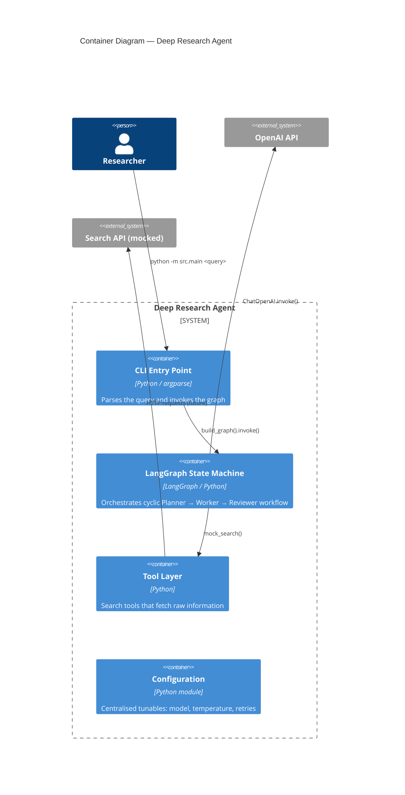

# C4 — Level 2: Container

Shows the internal containers (processes / packages) of the system.

```mermaid
C4Container
    title Container Diagram — Deep Research Agent

    Person(user, "Researcher")

    System_Boundary(dra, "Deep Research Agent") {
        Container(cli, "CLI Entry Point", "Python / argparse", "Parses the query and invokes the graph")
        Container(graph, "LangGraph State Machine", "LangGraph / Python", "Orchestrates cyclic Planner → Worker → Reviewer workflow")
        Container(tools, "Tool Layer", "Python", "Search tools that fetch raw information")
        Container(config, "Configuration", "Python module", "Centralised tunables: model, temperature, retries")
    }

    System_Ext(openai, "OpenAI API")
    System_Ext(search, "Search API (mocked)")

    Rel(user, cli, "python -m src.main <query>")
    Rel(cli, graph, "build_graph().invoke()")
    Rel(graph, tools, "mock_search()")
    Rel(graph, openai, "ChatOpenAI.invoke()")
    Rel(tools, search, "HTTP requests (future)")
```
