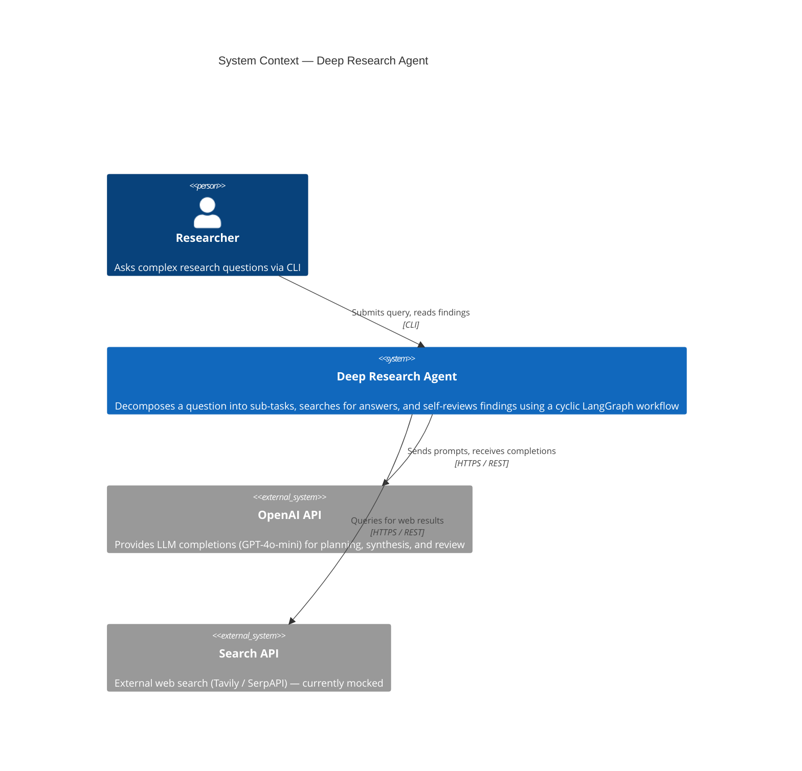

# C4 — Level 1: System Context

Shows the Deep Research Agent and its external dependencies.

```mermaid
C4Context
    title System Context — Deep Research Agent

    Person(user, "Researcher", "Asks complex research questions via CLI")

    System(dra, "Deep Research Agent", "Decomposes a question into sub-tasks, searches for answers, and self-reviews findings using a cyclic LangGraph workflow")

    System_Ext(openai, "OpenAI API", "Provides LLM completions (GPT-4o-mini) for planning, synthesis, and review")
    System_Ext(search, "Search API", "External web search (Tavily / SerpAPI) — currently mocked")

    Rel(user, dra, "Submits query, reads findings", "CLI")
    Rel(dra, openai, "Sends prompts, receives completions", "HTTPS / REST")
    Rel(dra, search, "Queries for web results", "HTTPS / REST")
```
